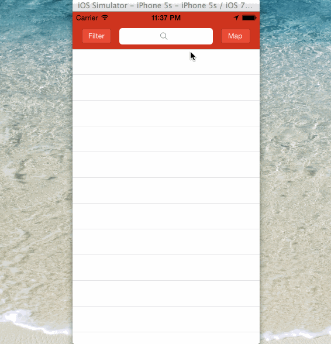

Yelp
====

A simple iOS Yelp client using [Yelp api](http://www.yelp.com/developers/documentation/v2/business)

Time Spent: 13 hours spent in total

Completed user stories:
 * Search results page
  * [x] Required: Table rows should be dynamic height according to the content height.
  * [x] Required: Custom cells should have the proper Auto Layout constraints.
  * [x] Required: Search bar should be in the navigation bar (doesn't have to expand to show location like the real Yelp app does).
  * [x] Optional: Infinite scroll for restaurant results.
  * [x] Optional: Implement map view of restaurant results.
  
 * Filter page
  * [x] Required: The filters you should actually have are: category, sort (best match, distance, highest rated), radius (meters), deals (on/off).
  * [x] Required: The filters table should be organized into sections as in the mock.
  * [x] Required: Radius filter should expand as in the real Yelp app.
  * [x] Required: Categories should show a subset of the full list with a "See All" row to expand.
  * [x] Required: Clicking on the "Search" button should dismiss the filters page and trigger the search w/ the new filter settings.  
 
Walkthrough of all user stories:

GIF created with [LiceCap](http://www.cockos.com/licecap/).

## Acknowledge

This app leverages several third-party libraries:

 * [BDBOAuth1Manager](https://github.com/bdbergeron/BDBOAuth1Manager).

 * [FlatUIKit](https://github.com/Grouper/FlatUIKit).
 
 * [TSMessages](https://github.com/toursprung/TSMessages).

 * [AFNetworking](https://github.com/AFNetworking/AFNetworking).
